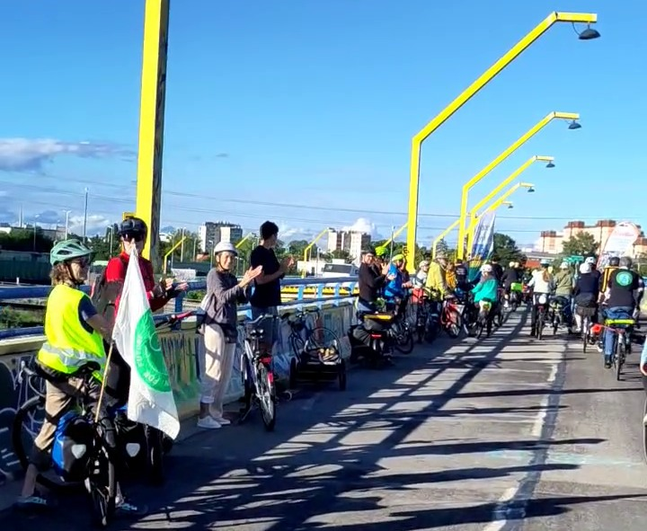

# partyciparade

> Partyciparade = Participation + Party + Parade

A stubbornly optimistic form of civil protest & party to praise the positive action that everyday climate heroes already do to fight the climate crisis. 

## Read the Manual / Anleitung

- **[PartyCiParade Anleitung (DE)](PartyCiParade%20Anleitung%20(DE).md)** 

- [ ] <u>PartyCiParade Manual (EN)</u> - English missing! Do you want to add it? Please do!

## List of partyciparades
We are starting small...

1. 2025-11-29 at the Bundesplenum of FridaysForFuture in Innsbruck, a mini inaugural party-ci-parade from plenary room to the dinner table.
2. 2026-05-15 at the Critical Mass Vienna Bike Protest with [Leobard](https://github.com/leobard) and [@ExBusFahrerMitKappe](https://www.instagram.com/exbusfahrermitkappe/) being the applauders. [Video](https://youtu.be/GpVVv6Hh0Xs).
3. 2026-06-05 at the [Radeln4Future Austria](https://radelnforfuture.at/) Vienna Bike Protest at [Steinitzsteg](https://radelnforfuture.at/steinitzsteg/) with hundreds of participants. [Video](https://www.leobard.net/blog/2026/10/08/partyciparade-bei-radeln4future-vienna-am-2026-06-05/).
4. 2026-08-09 at [Schönburn](https://www.burners.at/event/schoenburn-2026/) to celebrate the contributions of the participants
5. You are next! 
   Praise you!

## Get involved

- Do it! See what happens! Share your experience with [Leobard](https://github.com/leobard).
- Translate it! Submit a [pull request](https://github.com/leobard/partyciparade/pulls) once you are done.
- Suggest improvements or report partyciparades you did via [issues](https://github.com/leobard/partyciparade/issues) or [pull requests](https://github.com/leobard/partyciparade/pulls).
- [Join FridaysForFuture Austria](https://fridaysforfuture.at/mitmachen) and help co-organizing PartyCiParades. You won't be alone there, [Leobard](https://github.com/leobard) is already a member.

## Authors, Copyright, License

Partyciparade was created by Leo Sauermann for [Fridays For Future Austria](https://www.fridaysforfuture.at) and is licensed using https://creativecommons.org/licenses/by/4.0/. See more in the manual files.

## Q & A

### This is a great idea, but not software. Why GitHub?
Partyciparade is a set of instructions how people can moderate a protest. It is intentionally published under [CC-BY-4.0](https://creativecommons.org/licenses/by/4.0/). GitHub is great for
- publishing Markdown
- evolving the text collaboratively
- discussing issues, improvements, variants
- forking new versions, allowing multiple variants (branches), synchronizing changes between forks, merging improvements back

## Thanks

... to many people who contributed to this idea

- **Everyone** at [Fridays For Future Austria](https://www.fridaysforfuture.at) who supported this idea. Special thanks to **Nina M. from Kärnten/Koroška** for your positive protest energy.
- **Annie Locke-Scherer**, architectural designer and builder, University lector, "MissChief" [ALScherer.com](https://www.alscherer.com/) for pointing out that temples or monuments are only one possible way to honor someone and that today's climate heroes rather deserve a good party.
- **\$teven Ra\$pa**,  Associate Director of Community Events, founding member of the Regional Network Committee and Regional Events Committee, [Burning Man](https://burningman.org/) for brainstorming how to celebrate Climate Heroes in a respectful participatory way.
- **Gregor Stöhr** / [@ExBusFahrerMitKappe](https://www.instagram.com/exbusfahrermitkappe/)  for getting it and going all in on our first public attempt. You are the [first follower that any movement needs](https://www.youtube.com/watch?v=fW8amMCVAJQ). 

## Related work

The idea has been around in various forms
-  [Die goldene Brücke](https://de.wikipedia.org/wiki/Die_goldene_Br%C3%BCcke_(Spiel))  
- Some rugby players form a "rugby tunnel" after the match and both teams go through it, receiving and giving credit to their and the opposite team.